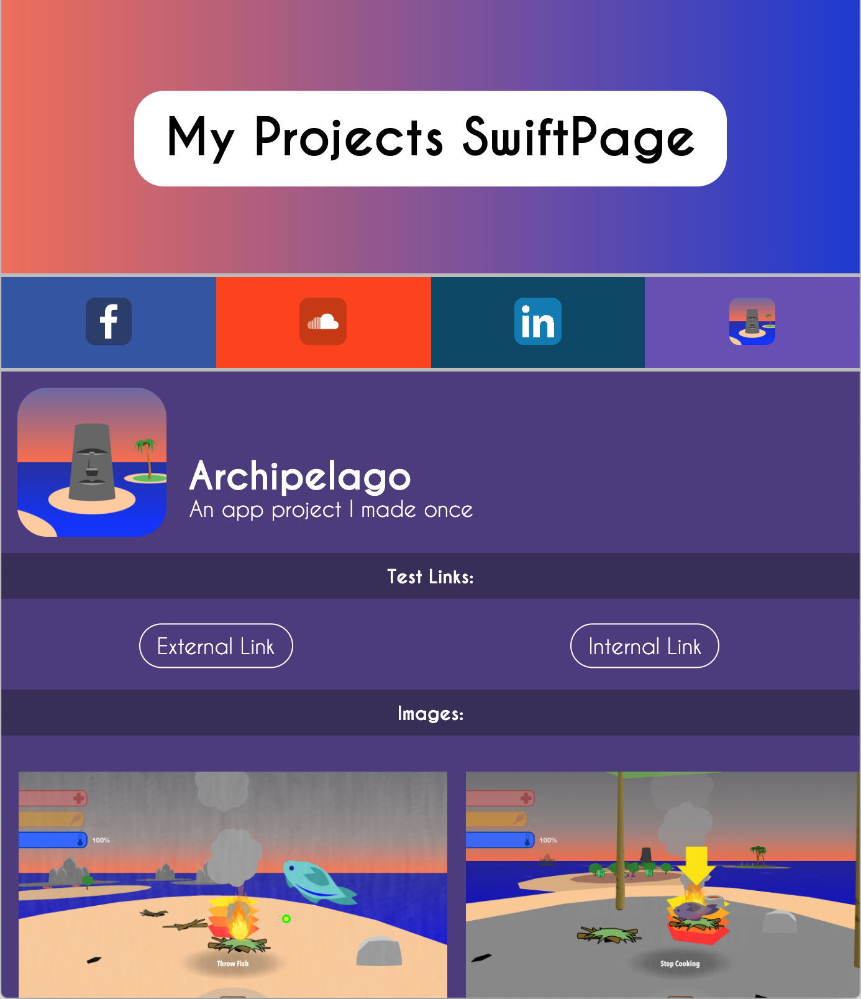

# SwiftPage

## What is SwiftPage?

SwiftPage is a series of Python scripts that let you generate good-looking websites in minutes with no web development experience nor design intuition.  Generated SwiftPages are aesthetically-pleasing, incredibly easy to set up and edit, and mobile-friendly.

## What can I use SwiftPage for?

Need a quick and dirty webpage that doesn't look like crap?  SwiftPage will help you transform your one-off webpages from this:

<table border='0'>
    <tr><td>
        
    </td>
    <td width='84'><center>To this:</center></td>
    <td>
        
    </td></tr>
</table>

SwiftPage will let you easily generate a well-designed, aesthetically pleasing webpage without knowing modern web development techniques or good design precedents.  It's quick and dirty webpages made easy and beautiful!

## What makes SwiftPage unique?

Many tools already exist for creating websites without needing to know any coding language or technical procedure.  Many of these tools, however, still require users to learn a new user interface or spend lots of extra time trying to make something aesthetically pleasing.

SwiftPage makes all of these issues pretty much trivial – SwiftPage lets you create content-rich webpages in *minutes* that look great *by default* (and they're mobile-friendly).

## What are some SwiftPage examples?

My Website - http://www.magmhj.com

MIT Animation Groups Website - http://mitag.mit.edu

## How do I set up SwiftPage and what are its dependencies?

SwiftPage relies on one external Python package (at the moment), which can be installed using the following terminal command(s):

```
pip install Pillow
```

Setting up SwiftPage after installing these packages is very easy.  Simply download or clone this repository, and run `python create_page.py` to ensure that everything is working properly.

```
git clone [repository address of your choice]
cd swiftpage/
python create_page.py
```

## How do I use SwiftPage?

SwiftPage provides two scripts, `create_page.py` and `server.py` that you can run to generate a new HTML5 website in the `site/` directory.

The file `page.py` is where you define the content of your SwiftPage.  In the `Page` constructor, you specify the Components that will be rendered on the page, which is explained in further detail in the section below.

Running `python create_page.py` will look at the specified page in `page.py`, print warnings about potentially problematic design choices, and save a new HTML5 SwiftPage inside the `site/` directory *once*.

Running `python server.py`, on the other hand, will start a server that will detect when `page.py` has been changed, automatically regenerate the SwiftPage inside the `site/` directory, and refresh `dev_server.html` in your default web browser.  Therefore, with `server.py` running, you can edit `page.py` like an HTML file and see your changes automatically update in your web browser.

SwiftPage works by generating code that fits to the preexisting contents of the `site/` directory.  The idea is that you can drag any relevant images and files into the `site/` directory, then run `create_page.py` or `server.py` to automatically generate code that points to everything correctly so you don't have to worry about file paths and heirarchies!

**TL/DR:** `python create_page.py` generates your page *once*, `python server.py` generates your page whenever `page.py` changes.

## How can I customize my SwiftPages?

To customize your SwiftPage, change the rendered `Page` object in `page.py`.  `Page` objects can be created with a specified list of Components, like Rows, NavBars, and Sections.  Each of these Components has certain parameters which affect its appearance and behavior as follows:

### Rows

Rows have lots of different capabilities, but they are the smallest singular units of information that SwiftPage parses and renders.  When constructing a new Row, its **first parameter** is a string that defines the Row's **type**, which determines what additional information it requires.  Its **second parameter** is a dictionary of **relevant metadata** about the Row that is specific for the Row's type.

Here is a list of currently-supported standalone Row types and the parameters they adhere to:


#### Type: Logo - "logo"

Metadata parameters:

- "filename": String, optional, name of logo image file within `images` directory
- "height": Integer, optional, changes the height of the logo image if "filename" is defined
- "text": String, optional, logo text, can be rendered when "filename" is defined or undefined
- "text-color": String hex code, optional, changes color of text when "text" is defined
- "rounded": String "true" or "false", optional, defines whether or not text is surrounded by rounded background
- "rounded-color": String hex code, optional, changes color of rounded background if "rounded" is "true"
- "rounded-border-color": String hex code, optional, changes color of rounded background border
- "background-colors": list of String hex codes, optional, changes background color to gradient between the first and last provided colors
- "background-filename": String, optional, name of background image file within `images` directory
- "snippet": String, optional, HTML snippet of code that is rendered if "filename" and "text" are both not defined

Example construction:

```
Row("logo", {
    "text": "My Projects SwiftPage",
    "rounded": "true",
    "background-colors": ["#f06d55", "#1a32d5"],
})
```

Appearance:


#### Type: Footer - "footer"

Metadata parameters:

- "snippet": String, optional, HTML snippet of code
- "text": String, optional, text that is rendered when "snippet" is not defined
- "text-color": String hex code, optional, changes color of text
- "background-colors": list of String hex codes, optional, changes background color to gradient between the first and last provided colors

Example construction:

```
Row("footer", {
    "text": "All Rights Reserved.",
    "text-color": "#242424",
})
```

Appearance:


All other Row types are not intended for standalone use – they are created and managed by Section objects, which are explained further in the section below.

### Sections

Sections essentially cluster related rows together.  For example, you could create a Section dedicated to a product, project, client, or service and all included Rows would share the same aesthetic theme.

Every Section is constructed with six parameters (three optional): 

- "name": String, the displayed name of the Section header
- "subtitle": String, the displayed subtitle of the Section header
- "filename": String, the prefix used within the `site/` directory to house all files related to this Section
- "row_info": List of dictionaries, optional, list of the metadata of the Section's Rows
- "primary_color": String hex code, optional, the main color of the Section
- "secondary_color": String hex code, optional, the secondary color of the Section used to separate Rows

Example construction:

```
Section("Archipelago", "An app project I made once", "archipelago", [
    {
        "name": "Images:",
        "type": "img_gallery",
    }
])
```


The "filename" parameter points to all files within the `site/` directory that are associated with this Section.  This means that, when generating your page, SwiftPage will search for an image with the filepath `site/images/[filename]_icon.png` to use as the main Section icon.  Also, if the "primary_color" and "secondary_color" parameters are left unspecified, SwiftPage will automatically estimate a series of complimentary colors to use for the Section based on the Section's main icon.

For each Section, a "Header" Row is automatically generated, which displays the main Section icon with the specified Section name and subtitle, like so:


The "filename" parameter also points to other files within the `site/` directory in some Rows, which are explained further below.

The "row_info" parameter defines the Rows that the Section contains/owns.  Each element in "row_info" is the metadata of the Row, which defines its type, content, appearance, etc.  These Rows inherit color and other stylistic traits from their parent Sections.  SwiftPage currently supports the following sub-Section Row types (not intended to be standalone), which can be created with the syntax described below:


#### Type: Image Gallery - "img_gallery"

Behavior:

- This type of Row will automatically search through the `site/images/[filename]/` directory for any image (.png, .jpg, .jpeg) files and display them in a horizontally-scrollable gallery.  Each image is sized automatically according to its width-to-height ratio.

Metadata parameters:

- "name": String, optional, if specified will generate a title Row with this name
- "multipliers": List of numbers, optional, the i-th number of this list (denoted `c`) will make the i-th image in this Row `c` times larger
- "extension": String, optional, if specified will search through the `site/images/[filename]/[extension]/` directory for images instead of `site/images/[filename]/`

Example construction:

```
{
    "name": "Images:",
    "type": "img_gallery",
}
```

Appearance:


#### Type: Links Panel - "links"

Behavior:

- This type of Row will hold any specified links and stylize them automatically.  Links with "addresses" that start with "#" will open in the same tab/window, all others will not.  (NOTE: All Sections are tagged with `<a name='[filename]'>` so you can link to them with the address `#[filename]`.)

Metadata parameters:

- "name": String, optional, if specified will generate a title Row with this name
- "links": List of dictionaries, optional, each dictionary item needs a "name" (e.g. "MagMHJ.com") and "address" (e.g. "http://www.magmhj.com")

Example construction:

```
{
    "name": "Test Links:",
    "type": "links",
    "links": [
        { "name": "External Link", "address": "http://www.magmhj.com/" },
        { "name": "Internal Link", "address": "#archipelago" }
    ]
}
```

Appearance:


#### Type: YouTube Video/Playlist - "video-youtube"

Metadata parameters:

- "address": String, embed URL for YouTube video
- "name": String, optional, if specified will generate a title Row with this name

Example construction:

```
{
    "name": "Trailer:",
    "type": "video-youtube",
    "address": "https://www.youtube.com/embed/NKnghW8DiI8"
}
```

Appearance:


#### Type: Vimeo Video - "video-vimeo"

Metadata parameters:

- "address": String, embed URL for Vimeo video
- "name": String, optional, if specified will generate a title Row with this name

Example construction:

```
{
    "type": "video-vimeo",
    "name": "Demo Video:",
    "address": "https://player.vimeo.com/video/242282080",
}
```

Appearance:


#### Type: Downloadable Files List - "files"

Metadata parameters:

- "name": String, optional, if specified will generate a title Row with this name
- "links": List of dictionaries, optional, each dictionary item needs a "name" (e.g. "Primary Download") and an "address" or "filename" giving the name of the file within the `site/files/[section filename]/` directory (e.g. "download.zip" will generate a link to `site/files/[section filename]/download.zip` if the file exists)

Example construction:

```
{
    "name": "Downloads:",
    "type": "files",
    "links": [
        {"name": "Test Valid Download", "filename": "LaVieEnRose.tps"},
        {"name": "Test Invalid Download"}
    ]
}
```

Appearance:


### NavBars